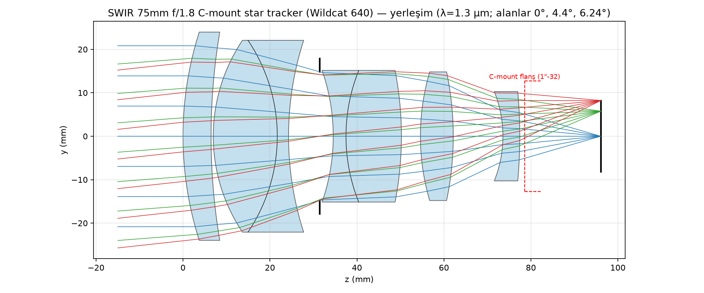
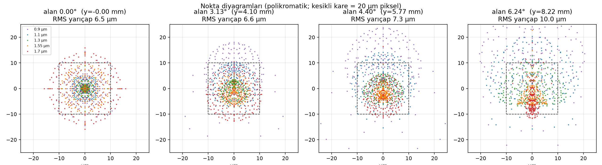
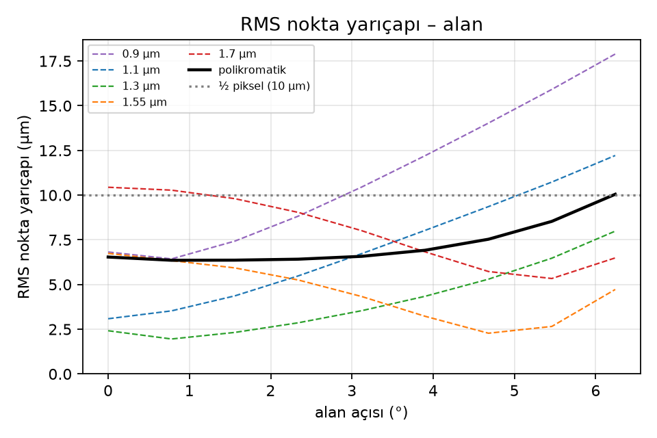
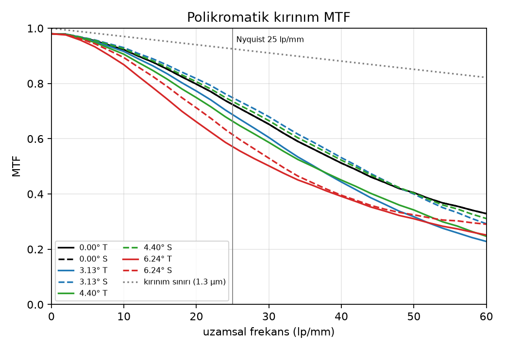
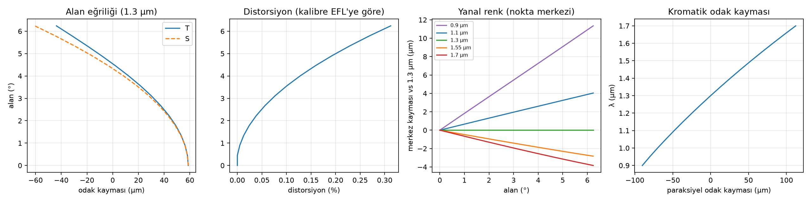
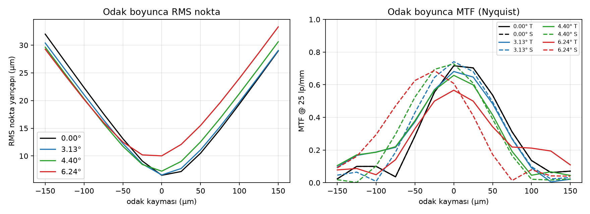

# SWIR 75 mm f/1.8 C-mount objektif — Xenics Wildcat 640 gündüz yıldız izleyici

Bu depo, **Xenics Wildcat 640** (InGaAs, 640 × 512 piksel, 20 µm piksel, 12,8 × 10,24 mm aktif alan,
16,4 mm köşegen, 0,9–1,7 µm, C-mount) kamerası için sıfırdan tasarlanmış, gündüz koşullarında
yıldız izleme amaçlı **EFL 75 mm, f/1,8, C-mount** bir objektifin tasarım dosyalarını,
tasarımı üreten ışın izleme/optimizasyon kodunu ve performans analizlerini içerir.

Tasarım Zemax OpticStudio dosyası (`results/swir_75mm_f18_cmount.zmx`) ve düz metin/CSV reçete
olarak verilmiştir; tüm analizler bağımsız bir Python ışın izleyiciyle (bu depoda) üretilmiştir.

## 1. Gereksinimler ve tasarım kararları

| Parametre | Değer | Not |
|---|---|---|
| Kamera | Xenics Wildcat 640 (CL/U3V 100/200) | XDS020 veri sayfası |
| Dedektör | InGaAs, 640 × 512, 20 µm, %100 dolgu | aktif alan 12,8 × 10,24 mm, köşegen 16,4 mm |
| Spektral bant | 0,9–1,7 µm | tasarım ağırlıkları 1,2–1,7 µm'ye kaydırıldı (aşağıda) |
| Odak uzaklığı | 75,00 mm | görüş alanı 9,75° × 7,81° (köşegen 12,5°), 55″/piksel |
| Diyafram | f/1,8 (EPD 41,7 mm) | kullanıcı kabulü: f/1,8 |
| Bağlantı | C-mount, 1″-32 UN, FFD 17,526 mm | arka eleman 1″ dişin içinden geçecek (≤ 20 mm açıklık) |
| Görüntü kalitesi hedefi | RMS nokta ≤ ½ piksel (10 µm), alan boyunca tekdüze | alt-piksel merkezleme için |
| Yanal renk | küçük ve doğrusal | yıldız rengine bağlı merkez kayması ≤ ~0,2 piksel |
| Distorsiyon | düşük ve düzgün | kalibre edilebilir (polinom) |

**Gündüz yıldız izleyici için neden bu öncelikler?** Gündüz çalışmada sınırlayıcı, gök fonu (sky
background) kaynaklı atış gürültüsüdür. SNR, yıldız enerjisinin mümkün olduğunca az piksele
toplanmasını (kompakt PSF) ister; alt-piksel merkezleme ise PSF'nin ~1 piksel genişliğinde ve
alan boyunca tekdüze olmasını ister. Bu yüzden hedef, kırınım sınırı değil, alan boyunca
**5–10 µm RMS (¼–½ piksel)** ve düşük **yanal renk**'tir (yıldızlar farklı renk sıcaklığında
olduğundan, yanal renk yıldız-rengine bağlı astrometrik sapma üretir). Gök fonu 0,9–1,2 µm'de
1,4–1,7 µm'ye göre çok daha parlaktır; pratikte 1,2–1,7 µm (veya 1,4–1,7 µm) bant geçiren filtre
kullanılır. Bu nedenle tasarım ağırlıkları 0,9 µm: 0,3 · 1,1 µm: 0,6 · 1,3 µm: 1,0 · 1,55 µm: 1,0 ·
1,7 µm: 0,8 olarak seçildi; 0,9 µm yine de kabul edilebilir kalitede tutuldu.

### C-mount kısıtının etkisi
C-mount dişinin iç çapı ~24,5 mm'dir; kameraya giren arka eleman için **≤ 20 mm serbest açıklık**
(yarı-çap 10 mm) ve flanşın ≥ 1 mm önünde arka tepe noktası şartı kondu. 16,4 mm görüntü
dairesi + f/1,8 koni ile bunu sağlamak için çıkış gözbebeği görüntüden ~45 mm önde tutuldu
(kenar alanda ana ışın açısı ~10°; InGaAs dizisi mikro-lenssiz ve %100 dolgu faktörlü olduğundan
sorun değildir). Arka grubu küçültmek ve Petzval eğriliğini gidermek için görüntü yakınına
negatif bir **alan düzleştirici** yerleştirildi.

## 2. Optik form ve cam seçimi

Form: **Petzval türevi, 7 eleman / 5 grup** — (+) menisk tekil, (+/−) yapıştırılmış dublet, **STOP**,
(−/+) yapıştırılmış dublet, (+) tekil, (−) alan düzleştirici. Tüm yüzeyler küreseldir (asfer yok).

SWIR'de cam dispersiyonu görünür bölgeden çok farklıdır. Depodaki `swirlens/glass.py` Sellmeier
kataloğu ile 0,9/1,3/1,7 µm için SWIR Abbe sayısı `V = (n1.3−1)/(n0.9−n1.7)` ve kısmi dispersiyon
`P = (n0.9−n1.3)/(n0.9−n1.7)` hesaplandı. Görünürde klasik olan N-LAK9/N-SF6 çifti SWIR'de
ΔV ≈ 8 ve büyük ΔP verir (ikincil spektrum → tüm alanlarda ~30 µm RMS; denendi ve elendi).
16 cam çifti otomatik tarandı (`swirlens/glass_search.py`); en iyi çift:

| Cam | n(1,3 µm) | V_SWIR | P_SWIR | Rol |
|---|---|---|---|---|
| **N-PSK53A** | 1,603 | 59,3 | 0,540 | pozitif elemanlar |
| **N-KZFS4** | 1,593 | 43,0 | 0,540 | negatif dublet elemanları |
| **N-SF6** | 1,768 | 40,2 | 0,612 | alan düzleştirici |

N-PSK53A / N-KZFS4 çiftinin SWIR kısmi dispersiyonları neredeyse eşittir (ΔP ≈ 0) → ikincil
spektrum çok düşüktür. Bütün camlar SCHOTT standart camıdır ve 1,7 µm'ye kadar iç geçirgenliği
yüksektir; 0,9–1,7 µm geniş bant AR kaplama önerilir.

## 3. Reçete

`results/prescription.txt` / `results/prescription.csv` / `results/swir_75mm_f18_cmount.zmx`

| Yüzey | Yarıçap (mm) | Kalınlık (mm) | Cam | Yarı-açıklık (mm) | Not |
|---|---|---|---|---|---|
| 1 | 78.8907 | 6.4516 | N-PSK53A | 23.674 | E1 front |
| 2 | 144.7114 | 0.5000 | hava | 22.818 |  |
| 3 | 39.6592 | 14.7230 | N-PSK53A | 21.774 | E2 (cem.) |
| 4 | -39.5405 | 2.5938 | N-KZFS4 | 20.988 | E3 (cem.) |
| 5 | 71.8958 | 7.1301 | hava | 17.044 |  |
| 6 | düz | 3.1374 | hava | 14.843 | DURDURUCU (STOP) |
| 7 | -46.0356 | 2.9368 | N-KZFS4 | 14.629 | E4 (cem.) |
| 8 | 40.6134 | 12.7450 | N-PSK53A | 14.468 | E5 (cem.) |
| 9 | -79.2578 | 4.3670 | hava | 14.851 |  |
| 10 | 52.4277 | 7.5507 | N-PSK53A | 14.505 | E6 |
| 11 | -72.3422 | 11.4161 | hava | 13.947 |  |
| 12 | -27.6687 | 3.8778 | N-SF6 | 9.981 | E7 field flattener |
| 13 | -115.2657 | 18.6482 | hava | 9.916 |  |
| IMG | düz | – | – | 8,200 | görüntü düzlemi (16,4 mm köşegen) |

EFL 75,000 mm · f/1,80 (EPD 41,67 mm) · BFL 18.707 mm · toplam uzunluk 96.08 mm · çıkış gözbebeği görüntüden 45.6 mm önde · kenar alanda ana ışın açısı 10.2°

## 4. Performans özeti

| Ölçüt | Eksen (0°) | 3,13° (%50) | 4,40° (%70) | 6,24° (köşe) | Hedef |
|---|---|---|---|---|---|
| Polikromatik RMS nokta yarıçapı (µm) | 6.5 | 6.6 | 7.5 | 10.0 | ≤ 10 |
| MTF @ 25 lp/mm (Nyquist) T / S | 0.74 / 0.74 | 0.70 / 0.76 | 0.68 / 0.75 | 0.59 / 0.63 | ≥ 0,5 |
| Kare-içi enerji, 1 piksel (20 µm) | 89 % | 93 % | 88 % | 76 % | – |
| Kare-içi enerji, 3 × 3 piksel | 100 % | 100 % | 100 % | 99 % | ≥ 95 % |
| Yanal renk, 1,1–1,7 µm (merkez kayması, µm) | 0 | 1,5 | 2,2 | 4,1 | ≤ 5 |
| Yanal renk, 0,9 µm'ye kadar (µm) | 0 | 4,1 | 6,2 | 11,5 | (filtre dışı) |
| Distorsiyon (kalibre EFL'ye göre) | – | – | – | 0.31 % (maks.) | ≤ 0,5 % |
| Bağıl aydınlatma | 1,00 | – | – | 0.93 | ≥ 0,9 |
| Kromatik odak kayması 0,9→1,7 µm (paraksiyel) | -90 … +112 µm | | | | |
| Kırınım sınırı (Airy yarıçapı, 1,3 µm) | 2,9 µm | | | | |


### Grafikler
| | |
|---|---|
|  | |
|  | |
|  |  |
|  | |
|  | |

### Yorum (yıldız izleyici bakışıyla)
- **PSF boyutu:** Tüm alanda RMS yarıçap 6–10 µm, yani ¼–½ piksel; 1 piksele düşen enerji %76–93,
  3 × 3 piksele %99. Bu, gök fonu gürültüsüne karşı yüksek SNR ile alt-piksel merkezlemenin
  (tipik ~0,05–0,1 piksel) birlikte sağlanabildiği bölgedir. Daha geniş PSF istenirse odak
  −30…−50 µm kaydırılarak PSF kontrollü biçimde büyütülebilir (bkz. odak boyunca grafikler).
- **Alan tekdüzeliği:** RMS ekseninden köşeye yalnızca 1,5× büyür; merkezleme hatası alan
  boyunca yaklaşık sabit kalır.
- **Yanal renk:** 1,1–1,7 µm bandında köşede ≤ 4 µm (0,2 piksel). Farklı renkteki yıldızlar
  için merkez kayması buna göre sınırlıdır ve alanla doğrusal olduğundan tek katsayılı
  bir renk-terimi ile kalibre edilebilir. 0,9 µm dâhil edilirse kayma 11 µm'ye çıkar; gündüz
  kullanımı için önerilen bant geçiren filtre bunu zaten dışlar.
- **Eksenel renk:** Paraksiyel odak 0,9→1,7 µm arasında ~200 µm kayar; bu, ikincil spektrum
  değil, optimizasyonun 1,2–1,7 µm ağırlıklarına göre bilinçli bıraktığı bir dengedir (0,9 µm
  ağırlığı düşük). Eksen nokta diyagramındaki 1,7 µm halkası bunun sonucudur; polikromatik
  RMS'ye katkısı hesaba dâhildir.
- **Distorsiyon:** ≤ 0,31 %, düzgün ve tek işaretli (yastık); 3. derece tek katsayı ile
  < 0,1 piksel kalıntıya indirgenir.
- **Odak derinliği:** Nyquist MTF'nin 0,5 üzerinde kaldığı aralık yaklaşık ±25 µm; sıcaklık
  aralığı için odak ayarı mekanizması gerekir (§6).

## 5. Tolerans duyarlılığı
`results/sensitivity.txt` — her tekil sapma sonrası odak yeniden ayarlanmıştır (odak, telafi
elemanı). Sonuçlar tasarımın **gevşek toleranslı** olduğunu gösterir:

| Sapma | ΔRMS (µm) | Gerekli odak telafisi (µm) | Boresight kayması (µm) |
|---|---|---|---|
| Element S12-S13 decentre 20 um | 0.49 | 0.0 | -10.88 |
| Element S7-S9 decentre 20 um | 0.34 | 0.0 | -6.87 |
| S11 thickness +0.050 mm | 0.30 | -128.0 | 0.00 |
| S3 thickness +0.050 mm | 0.09 | -65.0 | 0.00 |
| S4 thickness +0.050 mm | 0.07 | -68.1 | 0.00 |
| S9 thickness +0.050 mm | 0.07 | -17.5 | 0.00 |
| Element S3-S5 decentre 20 um | -0.06 | 0.0 | 13.98 |
| S10 thickness +0.050 mm | 0.05 | -40.6 | 0.00 |

(Tam liste: `results/sensitivity.txt`. Yarıçap sapması %0,1 ≈ 3–5 saçak, kalınlık ±50 µm, merkez kaçıklığı 20 µm.)

Boresight sütunu, elemanın 20 µm merkez kaçıklığının eksen üzerindeki yıldız merkezini ne kadar
kaydırdığını gösterir (mutlak boresight yıldız izleyicide zaten yıldız kataloğuyla kalibre edilir;
önemli olan kararlılıktır).

## 6. Mekanik / entegrasyon notları
- Toplam uzunluk (S1 tepe → görüntü) 96.1 mm; flanştan öne uzunluk ≈ 78.6 mm; ön eleman çapı ~48 mm
  (kamera gövdesi 55 × 55 mm ile uyumlu). Arka eleman çapı 20 mm, flanşın 1.18 mm önünde.
- Odaklama: sonsuz için BFL = 18.707 mm (FFD 17,526 mm + 1.18 mm). Isıl/kalibrasyon için ±0,3 mm odak
  ayarı (tüm objektifi flanşa göre kaydıran helikoid ya da shim) önerilir; kırınım/piksel derinliği
  ±25 µm (bkz. odak boyunca MTF).
- Gündüz kullanım: derin, siyah anodize **güneş siperliği/baffle** (yarım görüş alanı 6,3°),
  iç yüzeylerde diş/yiv, tüm yüzeylerde 0,9–1,7 µm geniş bant AR (< %0,5); gök fonunu bastırmak
  için kamera penceresi önüne ya da flanş içine **1,2–1,7 µm (veya 1,4–1,7 µm) bant geçiren filtre**.
  Filtre C-mount içine konursa BFL filtre kalınlığının ~⅓'ü kadar uzar; filtre kamera penceresi
  önünde, dedektör paketinin içinde kalmalı ya da odak ayarı ile telafi edilmelidir.
- Merkezleme için sıkı hassasiyet gerekmez: 20 µm eleman kaçıklığı RMS'yi < 0,4 µm bozar; en
  hassas yüzeyler S7 (arka dublet ön yüzü) ve S3'tür (yarıçap %0,1 → ≤ 0,1 µm RMS, odakla telafi edilir; en büyük etki S11 hava aralığında 50 µm → 0,3 µm).
- Kütle tahmini: cam ~165 g; alüminyum hücre ve C-mount ile ~350–400 g.

## 7. Kodun kullanımı

```bash
pip install -r requirements.txt
python -m swirlens.glass            # SWIR cam tablosu (V, P) ve Sellmeier öz-denetimi
python -m swirlens.optimize N-PSK53A N-KZFS4 results/design_opt.json   # kademeli optimizasyon (f/2.8→2.2→1.8)
python -m swirlens.glass_search     # 16 cam çiftini paralel tarar (results/search/)
python -m swirlens.refine results/search/N-PSK53A_N-KZFS4.json 700     # cam varyantları
python -m swirlens.polish 3.0 results/polish.json 0 results/design_final.json  # yanal renk ağırlıklı cila
python -m swirlens.run_analysis results/design_final.json results       # tüm grafik/tablolar
```

`swirlens/raytrace.py`: küresel yüzeyler için vektörleştirilmiş sıralı gerçek ışın izleme
(Spencer–Murty kesişim, vektörel Snell, optik yol uzunluğu), paraksiyel izleme (EFL, BFL,
gözbebekleri), stop'a ışın nişanlama. `swirlens/optimize.py`: sönümlü en küçük kareler
(SciPy TRF) ile polikromatik RMS nokta + kısıt (EFL, C-mount arka açıklık, kenar kalınlıkları,
stop-cam boşluğu, toplam uzunluk, ana ışın açısı). `swirlens/analysis.py`: nokta diyagramı,
kırınım MTF (gözbebeği otokorelasyonu, yanal renk dâhil polikromatik OTF), alan eğriliği,
distorsiyon, yanal renk, kromatik odak kayması, kare-içi enerji, bağıl aydınlatma, odak boyunca
MTF, tolerans duyarlılığı (odak telafili), Zemax/CSV dışa aktarım.

## 8. Sınırlamalar
- Kamera penceresi/soğuk filtre kalınlığı veri sayfasında verilmediği için görüntü uzayı hava
  kabul edildi; pencere odak ayarıyla telafi edilir (bkz. §6).
- Sellmeier katsayıları SCHOTT kataloğundan alınmıştır ve nd ile doğrulanmıştır; üretim öncesi
  gerçek eriyik verileriyle yeniden optimizasyon önerilir.
- Isıl analiz yapılmamıştır; −40…+70 °C aralığında odak kayması ayrı çalışılmalıdır (alüminyum
  hücre ile birkaç on µm mertebesi beklenir).
