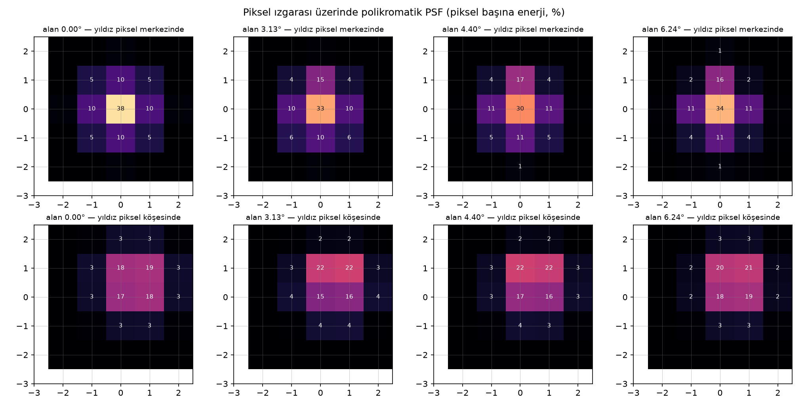
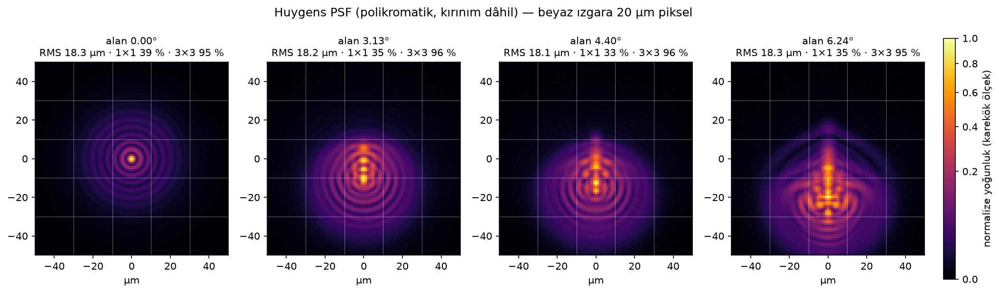
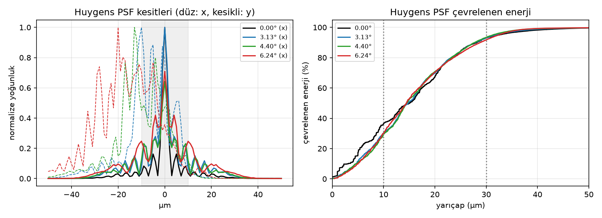
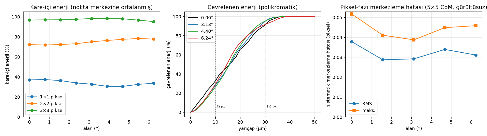
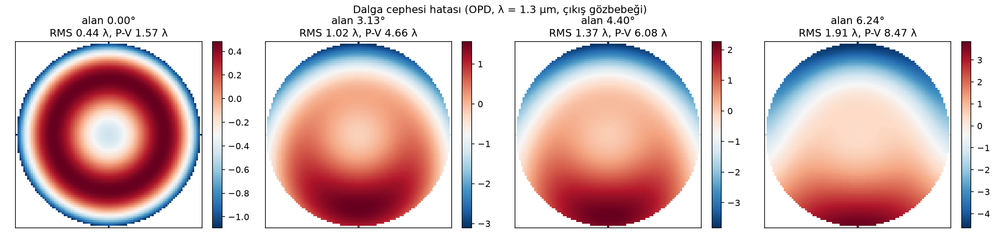
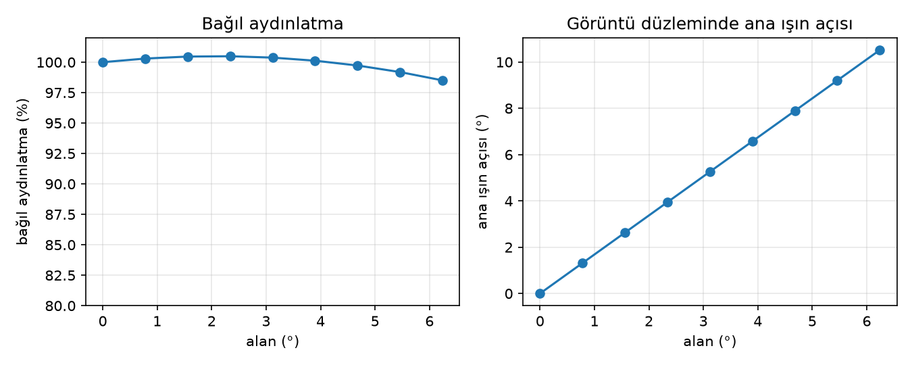
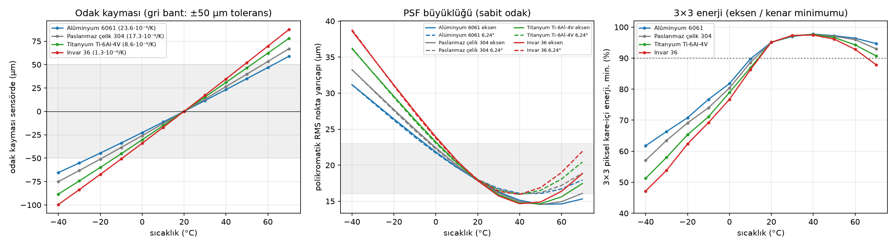

# SWIR 75 mm f/1,8 C-mount objektif — Xenics Wildcat 640 gündüz yıldız izleyici (Rev. C)

Bu depo, **Xenics Wildcat 640** (InGaAs, 640 × 512 piksel, 20 µm piksel, 12,8 × 10,24 mm aktif alan,
16,4 mm köşegen, 0,9–1,7 µm, C-mount) kamerası için sıfırdan tasarlanmış, gündüz koşullarında
yıldız izleme amaçlı **EFL 75 mm, f/1,8, C-mount** bir objektifin tasarım dosyalarını,
tasarımı üreten ışın izleme/optimizasyon kodunu ve performans analizlerini içerir.

Tasarım Zemax OpticStudio dosyası (`results/swir_75mm_f18_cmount.zmx`) ve düz metin/CSV reçete
olarak verilmiştir; tüm analizler bağımsız bir Python ışın izleyiciyle (bu depoda) üretilmiştir.

## 1. Gereksinimler ve tasarım kararları

| Parametre | Değer | Not |
|---|---|---|
| Kamera | Xenics Wildcat 640 (CL/U3V 100/200) | XDS020 veri sayfası |
| Dedektör | InGaAs, 640 × 512, 20 µm, %100 dolgu | aktif alan 12,8 × 10,24 mm, köşegen 16,4 mm |
| Spektral bant | 0,9–1,7 µm | tasarım ağırlıkları 1,2–1,7 µm'ye kaydırıldı (aşağıda) |
| Odak uzaklığı | 75,00 mm | görüş alanı 9,75° × 7,81° (köşegen 12,5°), 55″/piksel |
| Diyafram | f/1,8 (EPD 41,7 mm) | kullanıcı kabulü: f/1,8 |
| Bağlantı | C-mount, 1″-32 UN, FFD 17,526 mm | arka eleman 1″ dişin içinden geçecek (≤ 20,5 mm açıklık) |
| PSF hedefi | RMS nokta yarıçapı 18 µm (σ ≈ 0,64 px, FWHM ≈ 1,5 px), her alan ve dalga boyunda eşit, Gauss benzeri | alt-piksel merkezleme; enerji 3×3 pikselde |
| Odak duyarsızlığı | ±50 µm odak kaymasında PSF büyüklüğü korunur | ısıl kayma, montaj |
| Yanal renk | küçük ve doğrusal | yıldız rengine bağlı merkez kayması ≤ ~0,2 piksel |
| Distorsiyon | düşük ve düzgün | kalibre edilebilir (polinom) |

**Gündüz yıldız izleyici için neden bu öncelikler?** Gündüz çalışmada sınırlayıcı, gök fonu (sky
background) kaynaklı atış gürültüsüdür. Yıldızın enerjisi tek piksele toplanırsa merkez (centroid) hesabı piksel-kilitli
olur ve alt-piksel doğruluk kaybolur; enerji çok yayılırsa gök fonu gürültüsü baskın çıkar.
Optimum, **σ ≈ 0,6–0,7 piksel (FWHM ≈ 1,5 px) Gauss benzeri, alan ve dalga boyu boyunca tekdüze**
bir PSF'dir. Bu yüzden objektif kırınım sınırına değil, **18 µm RMS yarıçaplı (0,9 px)**, şekli ve
büyüklüğü kontrol edilmiş bir PSF'ye ve düşük **yanal renk**'e optimize edildi (yıldızlar farklı renk sıcaklığında
olduğundan, yanal renk yıldız-rengine bağlı astrometrik sapma üretir). Gök fonu 0,9–1,2 µm'de
1,4–1,7 µm'ye göre çok daha parlaktır; pratikte 1,2–1,7 µm (veya 1,4–1,7 µm) bant geçiren filtre
kullanılır. Bu nedenle tasarım ağırlıkları 0,9 µm: 0,3 · 1,1 µm: 0,6 · 1,3 µm: 1,0 · 1,55 µm: 1,0 ·
1,7 µm: 0,8 olarak seçildi; 0,9 µm yine de kabul edilebilir kalitede tutuldu.

### C-mount kısıtının etkisi
C-mount dişinin iç çapı ~24,5 mm'dir; kameraya giren arka eleman için **≤ 20,5 mm serbest açıklık**
(yarı-çap 10,25 mm, diş dibinde ≈ 2 mm hücre duvarı) ve flanşın ≥ 1 mm önünde arka tepe noktası şartı kondu. 16,4 mm görüntü
dairesi + f/1,8 koni ile bunu sağlamak için çıkış gözbebeği görüntüden ~45 mm önde tutuldu
(kenar alanda ana ışın açısı ~10°; InGaAs dizisi mikro-lenssiz ve %100 dolgu faktörlü olduğundan
sorun değildir). Arka grubu küçültmek ve Petzval eğriliğini gidermek için görüntü yakınına
negatif bir **alan düzleştirici** yerleştirildi.

## 2. Optik form ve cam seçimi

Form: **Petzval türevi, 7 eleman / 5 grup** — (+) menisk tekil, (+/−) yapıştırılmış dublet, **STOP**,
(−/+) yapıştırılmış dublet, (+) tekil, (−) alan düzleştirici. Tüm yüzeyler küreseldir (asfer yok).

SWIR'de cam dispersiyonu görünür bölgeden çok farklıdır. Depodaki `swirlens/glass.py` Sellmeier
kataloğu ile 0,9/1,3/1,7 µm için SWIR Abbe sayısı `V = (n1.3−1)/(n0.9−n1.7)` ve kısmi dispersiyon
`P = (n0.9−n1.3)/(n0.9−n1.7)` hesaplandı. Görünürde klasik olan N-LAK9/N-SF6 çifti SWIR'de
ΔV ≈ 8 ve büyük ΔP verir (ikincil spektrum → tüm alanlarda ~30 µm RMS; denendi ve elendi).
16 cam çifti (1. tur) ve tam SCHOTT kataloğundan analitik ön elemeyle 64 çift (2. tur, termal ağırlıklı) otomatik tarandı (`swirlens/glass_search.py`, `swirlens/glass_search2.py`); seçilen camlar:

| Cam | n(1,3 µm) | V_SWIR | P_SWIR | Rol |
|---|---|---|---|---|
| **N-PSK53A** | 1,603 | 59,3 | 0,540 | pozitif elemanlar |
| **N-KZFS11** | 1,616 | 41,8 | 0,542 | negatif dublet elemanları |
| **N-SF6** | 1,768 | 40,2 | 0,612 | alan düzleştirici |

N-PSK53A / N-KZFS11 çiftinin SWIR kısmi dispersiyonları neredeyse eşittir (ΔP ≈ 0,002) → ikincil
spektrum çok düşüktür. İkinci tur taramada (64 çift, termal ağırlıklı merit, üretilebilirlik kısıtları) bu çift,
N-PSK53A/N-KZFS4 ile başa baş çıkmış ve daha düzgün PSF / daha düşük yanal renk verdiği için seçilmiştir. Bütün camlar SCHOTT standart camıdır ve 1,7 µm'ye kadar iç geçirgenliği
yüksektir; 0,9–1,7 µm geniş bant AR kaplama önerilir.

## 3. Reçete

`results/prescription.txt` · `results/prescription.csv` · `results/swir_75mm_f18_cmount.zmx` (Zemax OpticStudio) · `results/design_final.json`

EFL 75,000 mm · f/1,80 (gerçek giriş demeti çapı 41,67 mm) · BFL 18.715 mm · toplam uzunluk S1→görüntü 89.35 mm · flanştan öne 71.8 mm

| Yüzey | Yarıçap (mm) | Kalınlık (mm) | Cam | Yarı-açıklık (mm) | Not |
|---|---|---|---|---|---|
| 1 | 47.9374 | 5.1959 | N-PSK53A | 23.104 | E1 front |
| 2 | 101.0615 | 0.5000 | AIR | 22.617 |  |
| 3 | 42.3514 | 13.0000 | N-PSK53A | 21.511 | E2 (cem.) |
| 4 | -44.5097 | 3.6036 | N-KZFS11 | 20.711 | E3 (cem.) |
| 5 | 75.6913 | 2.4654 | AIR | 16.630 |  |
| 6 | düz | 2.1418 | AIR | 16.324 | DURDURUCU (STOP) |
| 7 | -87.1017 | 3.4837 | N-KZFS11 | 15.996 | E4 (cem.) |
| 8 | 66.0926 | 12.3528 | N-PSK53A | 15.332 | E5 (cem.) |
| 9 | -122.8113 | 4.0195 | AIR | 14.926 |  |
| 10 | 107.9625 | 12.6901 | N-PSK53A | 14.083 | E6 |
| 11 | -57.1981 | 7.3720 | AIR | 12.641 |  |
| 12 | -24.6202 | 4.0000 | N-SF6 | 9.978 | E7 field flattener |
| 13 | -82.8538 | 18.5260 | AIR | 9.982 |  |
| IMG | düz | — | — | 8.200 | görüntü düzlemi (16,4 mm köşegen) |

Yarı-açıklıklar vinyetlemesiz ışın izlerinden gelen serbest açıklıklardır; mekanik kenar için +0,5–0,8 mm eklenmelidir. Stop (yüzey 6) E4'ün 3,1 mm önünde, camdan bağımsız bir halkadır; çapı gerçek eksenel kenar ışınının 41,67 mm giriş demetiyle geçmesine göre belirlenmiştir.

## 4. Performans özeti

**Nihai tasarım (yıldız izleyici PSF'si)** ile aynı optik formun **keskin referans çözümü** (`results/reference_sharp/`; aynı camlar ve mekanik zarf, blur tasarımının başlangıç noktası) yan yana:

| Ölçüt | Nihai (yayılmış PSF) | Keskin referans | Yıldız izleyici için anlamı |
|---|---|---|---|
| Polikromatik RMS nokta yarıçapı, 0° / 3,1° / 4,7° / 6,24° | 18.1 / 17.8 / 17.6 / 17.9 µm | 9.4 / 8.5 / 9.4 / 13.8 µm | hedef 18 µm ≈ σ 0,64 px (FWHM ≈ 1,5 px) |
| Kare-içi enerji 1×1 / 2×2 / 3×3 px, eksen | 37 % / 72 % / 97 % | 74 % / 100 % / 100 % | enerji 3×3 pencerede, 1×1'de < %40 |
| Kare-içi enerji 1×1 / 2×2 / 3×3 px, 6,24° | 34 % / 78 % / 95 % | 53 % / 92 % / 98 % | kenarda da aynı dağılım |
| **Sistematik (piksel-fazı) merkezleme hatası**, RMS / maks., eksen | **0.038 / 0.052 px** | 0.095 / 0.125 px | 5×5 ağırlık merkezi, gürültüsüz; 0,03 px ≈ 1,7″ |
| Sistematik merkezleme hatası, RMS / maks., 6,24° | 0.031 / 0.046 px | 0.072 / 0.101 px | |
| PSF şekli ⟨r⁴⟩/⟨r²⟩² | 1,8–2,0 (Gauss = 2) | 2,7–4,0 (çekirdek + hale) | pürüzsüz, yumuşak kenarlı PSF |
| Yanal renk 1,1–1,7 µm (0,9 µm dâhil) maks., kenar | 4.3 µm (11.6 µm) | 4,1 µm (14.9 µm) | yıldız rengine bağlı merkez kayması ≤ 0,16 px, doğrusal |
| Distorsiyon (kalibre EFL'ye göre, maks.) | 0.58 % yastık | 0.54 % | düzgün; 3. derece radyal polinomla kalibre edilir |
| MTF @ 25 lp/mm (Nyquist), T, eksen → kenar | 0.22 → 0.15 | 0.59 → 0.42 | blur tasarımında bilinçli olarak düşük |
| Bağıl aydınlatma (kenar) | 98.5 % | 97.7 % | vinyetleme yok |
| Ana ışın açısı (kenar) / çıkış gözbebeği | 10.5° / görüntüden 44 mm önde | aynı | InGaAs FPA için sorunsuz |
| Paraksiyel kromatik odak kayması 0,9→1,7 µm | -121 … +152 µm | -98 … +134 µm | blur büyüklüğü dalga boyuna göre dengelenmiştir |

**Odak boyunca davranış:** −75 … +25 µm odak kaymasında eksen RMS 15–21 µm, kenar 16–21 µm arasında kalır (bkz. `results/through_focus.png`).

**Dalga boyuna göre blur (eksen / kenar, RMS µm):** 0.9 µm: 17 / 24 · 1.1 µm: 20 / 21 · 1.3 µm: 19 / 18 · 1.55 µm: 18 / 14 · 1.7 µm: 19 / 14. PSF büyüklüğü yıldız rengine zayıf bağlıdır; blur salt odak kaydırmayla üretilseydi (±125 µm kromatik odak kayması nedeniyle) bu mümkün olmazdı.

### Grafikler










| | |
|---|---|
|  |  |
|  | |

Keskin referans çözümün nokta diyagramı ve ölçütleri: `results/reference_sharp/`. Ayrıntılı rapor: `docs/tasarim_raporu.html` / `.pdf`.

### Yorum (yıldız izleyici bakışıyla)
- **Neden 18 µm RMS?** Alt-piksel merkezleme için PSF'nin komşu piksellere yayılması gerekir; Gauss benzeri bir PSF için σ ≈ 0,6–0,7 px (FWHM ≈ 1,5 px), merkezleme hatası ile gök-fonu gürültüsü arasındaki bilinen optimumdur. Keskin referans tasarımda (enerjinin %74'i tek pikselde) piksel-fazına bağlı sistematik merkezleme hatası **0.10 px RMS** iken nihai tasarımda **0.038 px**'tir (≈ 4–5 kat iyileşme; kalan kısım alanla yavaş değişir ve kalibre edilebilir).
- **Kırınım dâhil (Huygens PSF):** Huygens düzlem-dalgacık toplamıyla hesaplanan polikromatik kırınım PSF'si geometrik sonucu doğrular: RMS yarıçap 18.1–18.3 µm, 3×3 piksel enerjisi ≥ 95 %, kırınım PSF'siyle sistematik merkezleme hatası ≤ 0.054 px RMS (`results/huygens_psf.png`).
- **Blur nasıl üretildi?** Odak kaydırarak değil, optimizasyonla: her alan **ve her dalga boyu** için RMS yarıçapı 18 µm hedeflendi, PSF şekli için ⟨r⁴⟩/⟨r²⟩² = 2 (Gauss) hedefi eklendi ve aynı hedef ±50 µm odak kaymasında da istendi (odak/ısıya duyarsız blur). Sonuç, dengelenmiş küresel sapma + hafif odak kayması ile üretilen, alan boyunca tekdüze bir PSF'dir.
- **Yanal renk** 1,1–1,7 µm'de ≤ 4.3 µm (kenarda, alanla doğrusal → kalibre edilebilir). 0,9 µm'de 12 µm; gündüz kullanımında bant geçiren filtre bu bölgeyi zaten dışlar.
- **Distorsiyon** %0.58 yastık ve alanla düzgün → yıldız kataloğu eşleştirmesinde 3. derece radyal modelle kalıntı < 0,05 px beklenir.
- **Boresight kararlılığı:** 20 µm eleman kaçıklığı ≤ 17 µm (0,85 px) boresight kayması verir; mutlak boresight uçuşta yıldızlarla kalibre edildiği için önemli olan ısıl/mekanik kararlılıktır (bkz. §5).

## 5. Tolerans duyarlılığı
`results/sensitivity.txt` — yarıçap (%0,1), kalınlık/hava aralığı (+50 µm) ve eleman kaçıklığı (20 µm)
sapmaları. Odak telafi elemanıdır: her sapma sonrası odak, alan-ortalamalı RMS'yi nominal değerine
geri getirecek şekilde ayarlanmıştır (montajda PSF büyüklüğü zaten odakla ayarlanır). Kaçıklık
satırlarında ΔRMS, blur'un alan boyunca tepe-tepe değişimidir. Tasarım **gevşek toleranslıdır**:
yarıçap/kalınlık hataları yalnızca odak düzeltmesi gerektirir, kaçıklıklar PSF tekdüzeliğini ≤ 0,5 µm bozar.

| Sapma | ΔRMS (µm) | Gerekli odak düzeltmesi (µm) | Boresight kayması (µm) |
|---|---|---|---|
| Element S12-S13 decentre 20 um | +1.21 | +0 | -11.7 |
| Element S1-S2 decentre 20 um | +0.32 | +0 | +11.2 |
| Element S3-S5 decentre 20 um | +0.30 | +0 | +11.1 |
| Element S10-S11 decentre 20 um | +0.12 | +0 | +13.1 |
| Element S7-S9 decentre 20 um | +0.06 | +0 | -3.7 |
| S4 thickness +0.050 mm | -0.00 | -84 | +0.0 |
| S7 thickness +0.050 mm | -0.00 | -14 | +0.0 |
| S8 thickness +0.050 mm | -0.00 | -14 | +0.0 |
| S1 radius +0.1% | -0.00 | -16 | +0.0 |
| S1 thickness +0.050 mm | -0.00 | -33 | +0.0 |
| S2 radius +0.1% | -0.00 | -33 | +0.0 |
| S4 radius +0.1% | -0.00 | -2 | +0.0 |

Boresight sütunu, elemanın 20 µm merkez kaçıklığının eksen üzerindeki yıldız merkezini ne kadar
kaydırdığını gösterir.

## 6. Mekanik / entegrasyon notları
- Toplam uzunluk (S1 tepe → görüntü) 89.4 mm; flanştan öne uzunluk ≈ 71.8 mm; ön eleman çapı ~48 mm
  (kamera gövdesi 55 × 55 mm ile uyumlu). Arka eleman serbest açıklığı 20,5 mm, arka tepe flanşın 1.19 mm önünde.
- Odaklama: sonsuz için BFL = 18.715 mm (FFD 17,526 mm + 1.19 mm). ±0,3 mm odak ayarı (helikoid ya da shim)
  önerilir. Montajda odak, kolimatör/yıldız görüntüsünde 3×3 kare-içi enerji ≥ %95 ve 1×1 ≤ %40 (RMS ≈ 17–18 µm)
  olacak şekilde ayarlanır; en hassas hava aralığı S11 (E6–düzleştirici; +50 µm → −135 µm odak) bu ayarla telafi edilir.
  PSF büyüklüğü ±50 µm odak hatasına toleranslıdır.
- Gündüz kullanım: derin, siyah anodize **güneş siperliği/baffle** (yarım görüş alanı 6,3°), iç yüzeylerde yiv,
  tüm yüzeylerde 0,9–1,7 µm geniş bant AR (< %0,5); gök fonunu bastırmak için **1,2–1,7 µm (veya 1,4–1,7 µm)
  bant geçiren filtre**. Filtre C-mount içine konursa BFL filtre kalınlığının ~⅓'ü kadar uzar; 1.19 mm boşluk
  ~3 mm filtre için yeterlidir (odak ayarı ile).
- Merkezleme için sıkı hassasiyet gerekmez: 20 µm eleman kaçıklığı PSF tekdüzeliğini ≤ 0,5 µm bozar.
- Kütle (cam, katalog yoğunlukları): ≈ 179 g; alüminyum hücre ve C-mount arayüzü ile ≈ 450 g.

### Termal analiz (dört gövde malzemesi)
`python -m swirlens.thermal` → `results/thermal.png`, `results/thermal.json`. Homojen sıcaklık, −40…+70 °C, sabit odak;
cam indisleri SCHOTT dn/dT modeli, cam ve gövde genleşmesi, alüminyum kamera gövdesi (flanş→sensör).



| Gövde | CTE (10⁻⁶/K) | Odak kayması −40 / +70 °C | RMS eksen −40/20/70 °C | RMS kenar −40/20/70 °C | 3×3 enerji min −40 / +70 °C | EFL ppm/K |
|---|---|---|---|---|---|---|
| Alüminyum 6061 | 23.6 | -65 / +59 µm | 31 / 18 / 15 µm | 31 / 18 / 18 µm | 62 % / 95 % | 44 |
| Paslanmaz çelik 304 | 17.3 | -75 / +67 µm | 33 / 18 / 16 µm | 33 / 18 / 19 µm | 57 % / 93 % | 46 |
| Titanyum Ti-6Al-4V | 8.6 | -88 / +78 µm | 36 / 18 / 17 µm | 36 / 18 / 20 µm | 51 % / 91 % | 48 |
| Invar 36 | 1.3 | -100 / +87 µm | 39 / 18 / 19 µm | 39 / 18 / 22 µm | 47 % / 88 % | 50 |

- Atermal gövde katsayısı ≈ 69·10⁻⁶/K; en iyi metal gövde tablodaki en küçük odak kaymasını verendir.
- Plaka ölçeği (EFL) 44–50 ppm/K sürüklenir (kenarda ±0,9 px / ±55 K) → sıcaklık indeksli kalibrasyon tablosu gerekir.
- Çözümler: montajda soğuk tarafa odak ön-ofseti (Al gövde: -50 µm → en kötü RMS 25 µm),
  ya da Al gövde ile seri ≈ 14 mm POM / ≈ 12 mm PTFE telafi ara parçası (pasif atermalizasyon), ya da aktif odak. Ayrıntı: `docs/tasarim_raporu.html` §14.

## 7. Kodun kullanımı

```bash
pip install -r requirements.txt
python -m swirlens.glass                 # SWIR cam tablosu (V, P) ve Sellmeier öz-denetimi (122 SCHOTT camı)
python -m swirlens.optimize N-PSK53A N-KZFS4 results/design_opt.json   # kademeli optimizasyon (f/2.8→2.2→1.8)
python -m swirlens.glass_search          # 1. tur: 16 cam çifti (keskin merit)
python -m swirlens.glass_search2 64 4    # 2. tur: analitik ön eleme + 64 çiftin termal ağırlıklı taraması (4 çekirdek)
python -m swirlens.polish in.json out.json lc=3 th=0.25                      # keskin cila (yanal renk + termal)
python -m swirlens.polish in.json out.json lc=3 target=18 shape=0.1 tf=50 th=0.25  # yıldız izleyici PSF'si
python -m swirlens.run_analysis results/design_final.json results --refocus-restore  # tüm grafik/tablolar
python -m swirlens.thermal               # dört gövde malzemesi için termal analiz
python -m swirlens.ghosts                # paraksiyel hayalet analizi
python -m swirlens.finalize <sharp.json> # seçilen camdan uçtan uca: cila, analizler, README, rapor, PDF
```

`swirlens/raytrace.py`: küresel yüzeyler için vektörleştirilmiş sıralı gerçek ışın izleme
(Spencer–Murty kesişim, vektörel Snell, optik yol uzunluğu), paraksiyel izleme (EFL, BFL,
gözbebekleri), stop'a ışın nişanlama. `swirlens/optimize.py`: sönümlü en küçük kareler
(SciPy TRF) ile polikromatik RMS nokta + kısıt (EFL, C-mount arka açıklık, kenar kalınlıkları,
stop-cam boşluğu, toplam uzunluk, ana ışın açısı); yıldız izleyici modunda hedef-RMS (alan × dalga boyu
× odak konumu), PSF basıklık (⟨r⁴⟩/⟨r²⟩²) ve yanal renk terimleri. `swirlens/analysis.py`: nokta diyagramı,
kırınım MTF (gözbebeği otokorelasyonu, yanal renk dâhil polikromatik OTF), alan eğriliği,
distorsiyon, yanal renk, kromatik odak kayması, kare-içi enerji, bağıl aydınlatma, odak boyunca
MTF, kare-içi/çevrelenen enerji, piksel-fazı merkezleme hatası simülasyonu, tolerans duyarlılığı
(odak telafili), Zemax/CSV dışa aktarım.

## 8. Sınırlamalar
- Merkezleme hatası simülasyonu geometrik PSF ile, gürültüsüz ve 5×5 ağırlık-merkezi algoritmasıyla
  yapılmıştır; kırınım (Airy yarıçapı ~3,5 µm) ve piksel MTF'si gerçek PSF'yi biraz daha yumuşatır,
  yani gerçek sistematik hata burada verilenden küçük olmalıdır. Farklı merkezleme algoritmaları
  (Gauss uydurma, eşikli CoM) için değerler değişir.
- Kamera penceresi/soğuk filtre kalınlığı veri sayfasında verilmediği için görüntü uzayı hava
  kabul edildi; pencere odak ayarıyla telafi edilir (bkz. §6).
- Sellmeier katsayıları SCHOTT kataloğundan alınmıştır ve nd ile doğrulanmıştır; üretim öncesi
  gerçek eriyik verileriyle yeniden optimizasyon önerilir.
- Isıl analiz homojen sıcaklık için yapılmıştır (§6, rapor §14); gradyanlar ve geçici rejim ayrı çalışılmalıdır.
